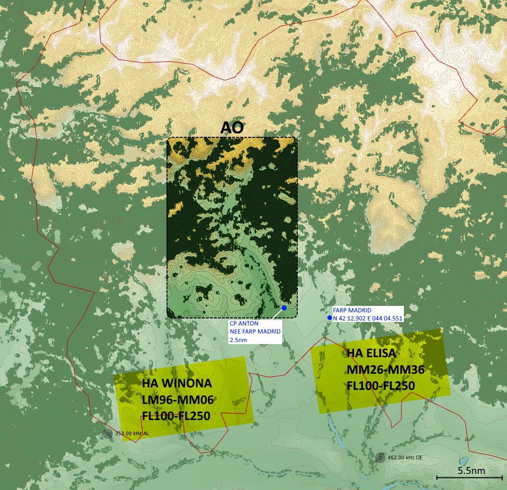
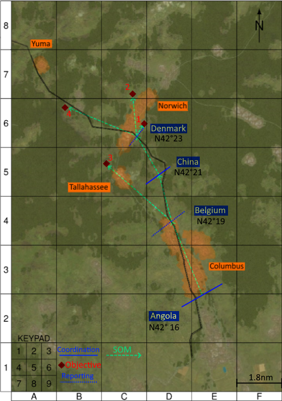
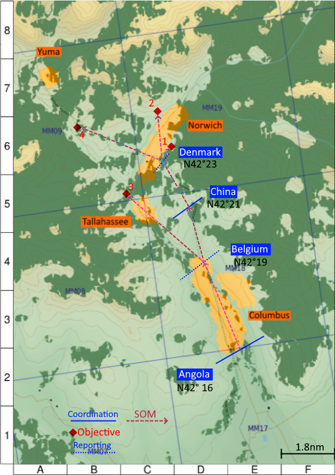
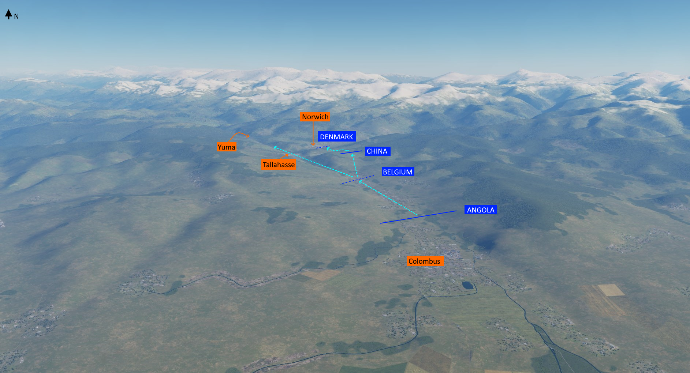
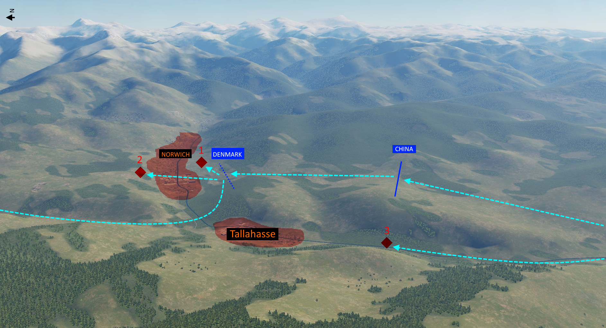
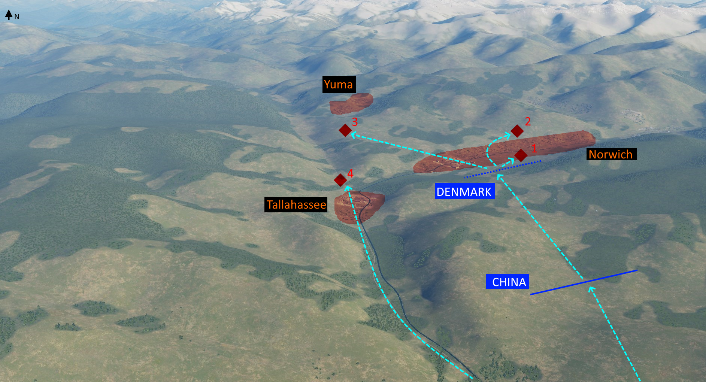

# REDFROST4 FRAGO CAS support TF STINGER

Edition: DRAFT 1

Publishing agency JTAC BRUTAL

Reference: http://132virtualwing.org/index.php/page/event?id=1245

## CHANGES

DRAFT 1: initial release

## Weather/terrain

April 1st; Approx. 0800G on event start

Temp 6c; Light wind blowing from WEST; scattered clouds base at 10000ft.

Terrain:

* peaks at 9000ft+ W, N and E of AO

## TASKORG

|   c/s  |           assets           |            mission            |
|:------:|:--------------------------:|:-----------------------------:|
| BEAST   | 3xA-10C                  | CAS / AR            |
| MISTY  | 2xA-10C                     | CAS / AR                   |
| AKULA | 3x Ka50  | CAS / AR           |
| GRIZZLY  | 1xMi8                     | On-call CASEVAC / MEDEVAC  |
| STINGER    | TF STRINGER                    | GFC                   |
| BRUTAL   | M2 IFV                   | JTAC in support STINGER |

## Situation

JTAC BRUTAL currently in transit, limited INTEL available for AO.

### Enemy

Enemy forces are from 503rd Guards Motorized Rifle Regiment.

503rd Guards Motorized Rifle Regiment ORBAT:
* (x31) T-80
* (x45) BTR-80
* (x6) 120mm mortars

503rd Guards Motorized Rifle Regiment is supported by 481st Anti-Aircraft Missile Regiment.

481st Anti-Aircraft Missile Regiment ORBAT:
* (x6) SA-8 OSA
* (x6) SA-15 TOR
* (x6) SA-13 STRELA
* (x14) ZSU-23 SHILKA

INTELLIGENCE ESTIMATE "ALPHA" Apr.1st, 2020G:
503rd Regiment - Estimated enemy ORBAT present IVO JAVA:
1. (x1) reduced armored company: estimated (x2) platoons of T80s, minus (x1) or (x2) MBTs that were destroyed yesterday by air attacks
2. (x1) motorized company: (x3) platoons of BTR80s
3. (x1) Reconnaissance company: (x2) or (x3) platoons of BMPs
4. ANTI-AIR:
   * At least (x1) SA-8 (ELINT intercept)
   * Expected SHILKA (x1-2)
   * Expected SA-13: (x1-2)
   
#### Intel update from GFC staff

> The NAI's (Named Area of Interest) are location where we can expect to meet enemy forces:
  "3" might - if anything - host infantry recon (due to rough terrain)
  "1" and "2" might have heavier stuff (AT capabilities)
  All the others are good for just about anything

### Friendlies

Friendly TF "STINGER" stationned N of Tskhinvali.

TF STINGER composition: 1x Armored company (4x ABRAM+BRADLEY platoons) + 2x RECON/TACP vehicles (BRADLEYs).

JTAC "BRUTAL" attached.

## Mission

Push the forward elements of the Russian's 503rd regiment back to the NORTH-EAST.

## Execution

Force QNH 29.92/760.

### Setup

#### AKULA

Contact JTAC brutal when visual with FARP MADRID. Depending on situation, expect on of:

* land at MADRID for re-arm refule;
* push to the AO.

Akula flight to maintain GND to 5000ft.

#### BEAST

Establish HA ELISA.

Contact JTAC BRUTAL 35nm out of HA ELISA.

Advise BRUTAL  at initial contact if able to RTB for re-arm/refuel then come back at a later time.

#### MISTY

Establish HA WINONA.

Contact JTAC BRUTAL 35nm out of HA WINONA.

Advise BRUTAL  at initial contact if able to RTB for re-arm/refuel then come back at a later time.

### CAS

#### GRG

Both GRG are identical; at discretion FL.

#### AKULA

Once within AO, expect one of following COAs:
1. If time permits (STINGER is SOUTH of BELGIUM): AR C4 D4 E4 (GRG);
1. Otherwise: neutral escort posture STINGER;

Expect heavy use of FCMs; Northings only will be used (cfr. GRG).

#### MISTY

Once established HA WINONA, expect one of following COAs:

1. SEAD in support of AKULA and BEAST;
2. (or) attack pre-briefed targets acquired by JTAC BRUTAL during earlier phase;

Expect heavy use of FCMs; Northings only will be used (cfr. GRG).

Unless otherwise briefed, all attacks must be made from the WEST, egress to the SOUTH.

At WINCHESTER BEAST, MISTY to take over reactive CAS to support advance STINGER

#### BEAST

Once established HA ELISA, expect one of following COAs (in order of likeliness):

1. If time permits (STINGER is SOUTH of BELGIUM): CAS against pre-briefed targets acquired by JTAC BRUTAL during earlier phase;
1. If time permits (STINGER is SOUTH of BELGIUM): AR box formed by GRG grid B7 (NW corner) to E5 (SE corner);
1. Otherwise: reactive CAS to support advance STINGER.

Expect heavy use of FCMs; Northings only will be used (cfr. GRG).

Unless otherwise briefed, all attacks must be made from the EAST, egress to the SOUTH.

### Target priorities

Target priority will be as follows:

1. Main Battle Tanks (MBTs)
2. APC
3. Mortar teams
4. Infantry

### Reconnaissance

## Service support

155mm battery (4x PALADINs) in direct support. Located N42 15.650 / E043 54.200/ 3963ft.

GRIZZLY flight 1xMi8 will be on-call CASEVAC/MEDEVAC for the AO.

## Command/signal

### Commplan

**Primary frequency: LIME2 (126.100)**

Brief and attack.

**Secondary frequency OCHRE11 (39.750)**

Back-up frequency.

### C2

TACON BEAST MISTY AKULA with JTAC BRUTAL on primary frequency at all times.

In case VIKING cannot be contacted all flights are to contact DARKSTAR 237.000 (GREY 6).

### Contact point

FW assets to contact BRUTAL 35nm out of assigned HA.

RW assets to contact BRUTAL at CP ANTON, ~2nm NEE of FARP MADRID (orbit IVO ANTON, priority to stay hidden from valley North of Tskhinvali).

## Loadouts

### BEAST

Per a/c:
* LAU-105 - 2 AIM-9M Sidewinder IR AAM
* AN/AAQ-28 LITENING
* (2x) LAU-88, AGM-65D*2
* (2x) LAU-68 * 3 - 7 -2.75' rockets M151 (HE)

### MISTY

Per a/c:
* LAU-105 - 2 AIM-9M Sidewinder IR AAM
* AN/AAQ-28 LITENING
* (2x) LAU-88, AGM-65D*3
* (2x) BGU-12

### AKULA

Per a/c:
* (2x) QPU-6 - 6 9A4172 Vikhr
* (2x) B-13L - 5 S-13 OF

